# Roamy ER Diagram

## Entity Relationship Diagram (Mermaid)

```mermaid
erDiagram
    USERS {
        BIGINT id PK
        STRING email UK
        STRING first_name
        STRING last_name
        STRING phone_number
        STRING role
        BOOLEAN enabled
        BOOLEAN verified
        STRING preferred_currency
        DATETIME created_at
        DATETIME updated_at
    }

    DESTINATIONS {
        BIGINT id PK
        STRING name
        STRING city
        STRING country
        STRING country_code
        DECIMAL latitude
        DECIMAL longitude
        TEXT description
        STRING image_url
        STRING time_zone
        STRING climate
        STRING best_time_to_visit
        DECIMAL budget_daily_cost
        DECIMAL mid_range_daily_cost
        DECIMAL luxury_daily_cost
        DECIMAL average_rating
        INT total_reviews
        INT popularity_score
        BOOLEAN active
    }

    HOTELS {
        BIGINT id PK
        BIGINT destination_id FK
        STRING name
        STRING address
        DECIMAL latitude
        DECIMAL longitude
        TEXT description
        STRING star_rating
        DECIMAL price_per_night
        STRING currency
        DECIMAL average_rating
        INT total_reviews
        STRING phone_number
        STRING email
        STRING website
        BOOLEAN available
        BOOLEAN featured
        STRING check_in_time
        STRING check_out_time
    }

    ROOMS {
        BIGINT id PK
        BIGINT hotel_id FK
        STRING room_number
        STRING room_type
        TEXT description
        INT max_occupancy
        INT number_of_beds
        STRING bed_type
        INT room_size_sqm
        DECIMAL base_price
        STRING currency
        BOOLEAN available
        BOOLEAN smoking_allowed
        BOOLEAN pet_friendly
    }

    ATTRACTIONS {
        BIGINT id PK
        BIGINT destination_id FK
        STRING name
        TEXT description
        STRING address
        DECIMAL latitude
        DECIMAL longitude
        STRING attraction_type
        DECIMAL entry_fee
        STRING currency
        BOOLEAN free_entry
        STRING opening_hours
        STRING operating_days
        DECIMAL average_rating
        INT total_reviews
        INT popularity_score
        BOOLEAN wheelchair_accessible
        BOOLEAN kids_friendly
        INT recommended_duration_hours
        STRING best_time_to_visit
        BOOLEAN active
        BOOLEAN featured
    }

    BOOKINGS {
        BIGINT id PK
        STRING booking_reference UK
        BIGINT user_id FK
        BIGINT hotel_id FK
        BIGINT room_id FK
        STRING type
        STRING transport_type
        STRING departure_location
        STRING arrival_location
        DATE check_in_date
        DATE check_out_date
        DATETIME departure_date
        DATETIME arrival_date
        INT number_of_guests
        INT number_of_adults
        INT number_of_children
        DECIMAL total_amount
        STRING currency
        STRING status
        STRING payment_status
        TEXT special_requests
        STRING contact_name
        STRING contact_email
        STRING contact_phone
        DATETIME created_at
        DATETIME updated_at
    }

    SEARCH_HISTORY {
        BIGINT id PK
        BIGINT user_id FK
        STRING from_location
        STRING to_location
        DATE check_in_date
        DATE check_out_date
        INT number_of_guests
        INT number_of_adults
        INT number_of_children
        DOUBLE min_budget
        DOUBLE max_budget
        STRING budget_currency
        INT hotel_min_rating
        INT hotel_max_rating
        INT results_count
        TEXT clicked_results
        STRING session_id
        STRING ip_address
        DATETIME search_date
        BOOLEAN converted_to_booking
        BIGINT booking_id
    }

    USER_INTERESTS {
        BIGINT user_id FK
        STRING interest
    }

    DESTINATION_INTERESTS {
        BIGINT destination_id FK
        STRING interest
    }

    HOTEL_AMENITIES {
        BIGINT hotel_id FK
        STRING amenity
    }

    HOTEL_IMAGES {
        BIGINT hotel_id FK
        STRING image_url
    }

    ROOM_AMENITIES {
        BIGINT room_id FK
        STRING amenity
    }

    ROOM_IMAGES {
        BIGINT room_id FK
        STRING image_url
    }

    ATTRACTION_INTERESTS {
        BIGINT attraction_id FK
        STRING interest
    }

    ATTRACTION_IMAGES {
        BIGINT attraction_id FK
        STRING image_url
    }

    SEARCH_INTERESTS {
        BIGINT search_history_id FK
        STRING interest
    }

    SEARCH_AMENITIES {
        BIGINT search_history_id FK
        STRING amenity
    }

    SEARCH_TRANSPORT_TYPES {
        BIGINT search_history_id FK
        STRING transport_type
    }

    USERS ||--o{ BOOKINGS : places
    USERS ||--o{ SEARCH_HISTORY : performs
    USERS ||--o{ USER_INTERESTS : has

    DESTINATIONS ||--o{ HOTELS : contains
    DESTINATIONS ||--o{ ATTRACTIONS : contains
    DESTINATIONS ||--o{ DESTINATION_INTERESTS : tagged_with

    HOTELS ||--o{ ROOMS : has
    HOTELS ||--o{ BOOKINGS : booked_in
    HOTELS ||--o{ HOTEL_AMENITIES : offers
    HOTELS ||--o{ HOTEL_IMAGES : has

    ROOMS ||--o{ BOOKINGS : booked_room
    ROOMS ||--o{ ROOM_AMENITIES : has
    ROOMS ||--o{ ROOM_IMAGES : has

    ATTRACTIONS ||--o{ ATTRACTION_INTERESTS : tagged_with
    ATTRACTIONS ||--o{ ATTRACTION_IMAGES : has

    SEARCH_HISTORY ||--o{ SEARCH_INTERESTS : filters_by
    SEARCH_HISTORY ||--o{ SEARCH_AMENITIES : filters_by
    SEARCH_HISTORY ||--o{ SEARCH_TRANSPORT_TYPES : filters_by

    BOOKINGS o|--|| SEARCH_HISTORY : conversion_source
```

## Notes

- This ERD is derived from JPA entities under `backend/src/main/java/com/roamy/entity` and collection tables used via `@ElementCollection`.
- `search_history.booking_id` is modeled as a logical link to `bookings.id` (it is not declared as a JPA relation in `SearchHistory`).
- Enum-backed fields (role, transport_type, room_type, etc.) are stored as strings.
